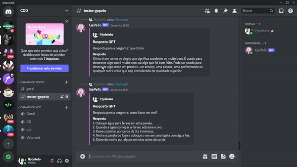

# discord-bot-gpt

  
  
  
  

Bot de discord integrado a API do chat-gpt

## config

 - Fill `.env` file based in `.env.example`
 - Run `npm install` to install project dependencies
 - Run `npm run dev` to start development server

# Tools

 - [Typescript](https://www.typescriptlang.org/)
 - [Node.js](https://nodejs.org/en/docs/)
 - [Discord.js](https://discord.js.org/)
 - [Openai](https://openai.com/)

 

---

Desenvolvido Por [Alessandro Massarotti Jr](https://github.com/alessandro-massarotti-jr) 🤖